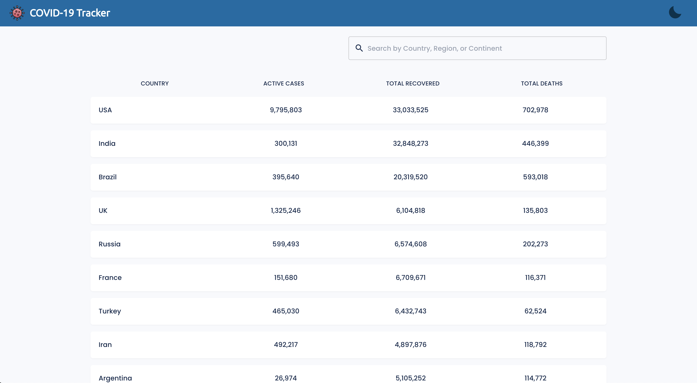
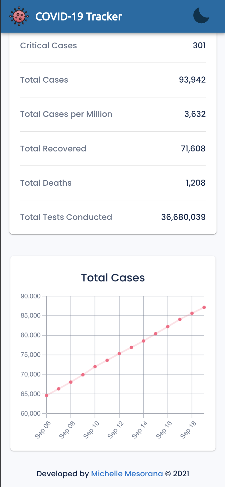

# COVID-19 Tracker

This is a web application that provides current worldwide statistics on the COVID-19 pandemic. The landing page displays world statistics in a table format listed by country. The statistics can be sorted by clicking on the table headers and filtered by using the search input at the top of the page. Clicking on any row within the table will take users to the country's details page, which contains more comprehensive statistics and a chart illustrating trends in the number of confirmed cases.

### Technologies Used

- React
- Next.js
- Material-UI
- JavaScript
- Chart.js/react-chartjs-2
- Vercel
- [Covid-19-API](https://github.com/M-Media-Group/Covid-19-API) from M-Media-Group

Visit the deployed app at: [COVID-19 Tracker](https://nextjs-covid19-tracker.vercel.app/)

##### Landing Page

## 

##### Details Page

## 

##### Dark Mode

## 

##### Mobile Views

